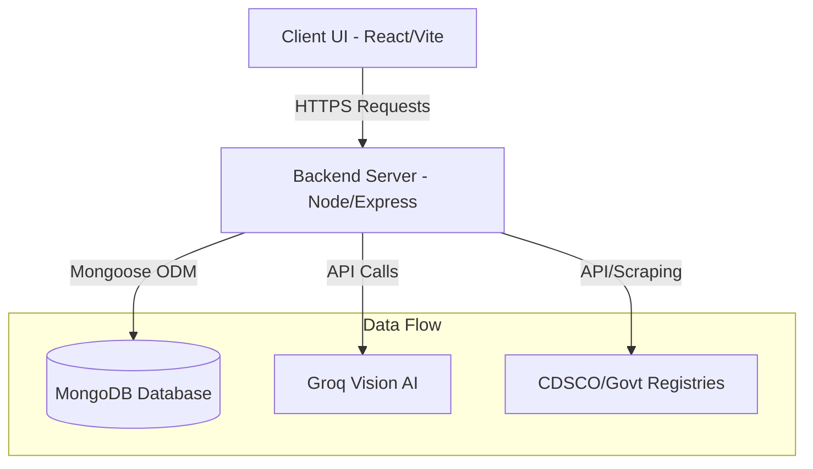
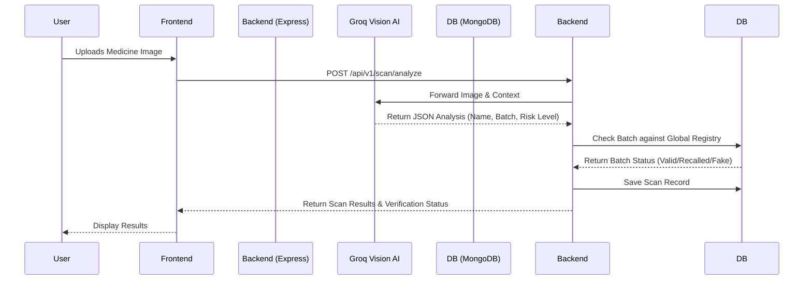

# MediGuard - AI-Powered Fake Medicine Detector 🛡️

**MediGuard** is a next-generation pharmaceutical integrity platform designed to secure the global supply chain. By utilizing advanced neural vision protocols and a robust verified network of chemists, it instantly detects counterfeit medicines, verifies manufacturing batches, and automatically reports anomalies to regulatory bodies (like CDSCO).

---

## 🎯 Core Features
- **Neural Vision Scanner**: Upload photos of medicine strips. Our AI (powered by Groq Vision models) performs sub-millimeter analysis of label textures, typography, and holograms to detect counterfeits.
- **Global Batch Sync**: Live cross-referencing with international regulatory databases and manufacturer repositories to check expiry and recall status.
- **Chemist Verification Network**: A decentralized network of verified pharmacies. Users can find authentic sellers nearby, and malicious pharmacies are instantly blacklisted.
- **CDSCO Direct Integration**: Automated alert triggers and regulatory reporting protocols for severe pharmaceutical violations.

---

## ⚙️ How It Works (System Architecture & Workflows)

### 1. High-Level Architecture
This diagram illustrates the overall system interactions between the client, backend, and external services.

### 2. The Verification Workflow (Neural Vision Scan)

---

## 🗄️ Database Structure & Models

The system is built on **MongoDB**, structured around three primary collections: `Users`, `Scans`, and `Chemists`.

### 1. User Model
Manages authentication and profiles.
- **Fields**: `name`, `email`, `password` (hashed), `role` (public, chemist, admin), `isVerified`.

### 2. Scan Model
Stores the result of every neural vision scan operation.
- **Fields**: 
  - `user` (Reference to User)
  - `imageUrl` (Cloudinary URL)
  - `result` (Enum: GENUINE, FAKE, SUSPICIOUS)
  - `confidence` (0-100 score)
  - `medicineDetails` (Sub-document: Name, MRP, Batch Number)
  - `riskLevel` (LOW, MEDIUM, HIGH, CRITICAL)
- **Indexes**: Indexed by `user` and `createdAt` for fast historical lookups.

### 3. Chemist Model
Manages verified pharmacy records.
- **Fields**: `shopName`, `licenseNumber`, `location` (GeoJSON Point), `verificationStatus`.
- **Geospatial Queries**: Uses MongoDB `2dsphere` index to locate nearby chemists based on user coordinate radius.

---

## ❓ Frequently Asked Questions (Q&A)

**Q1: How does the AI determine if a medicine is fake?**
A: MediGuard uses Groq's Vision AI (`llama-3.2-11b-vision-preview`). The AI acts as a forensics expert, visually inspecting typography, hologram integrity, spelling errors, and color shifts on the packaging, cross-referencing against standard formatting.

**Q2: How are nearby verified chemists found?**
A: When a user performs a scan or requests chemists, their geolocation coordinates are sent to the backend. MongoDB's `$nearSphere` geospatial query instantly returns chemists within a defined radius (e.g., 2km) who have a verified status.

**Q3: What happens when a "CRITICAL" fake is detected?**
A: The system automatically generates a "Report" object. It alerts the user immediately and can trigger automated webhooks directly to the CDSCO (Central Drugs Standard Control Organisation) or local health authorities.

---

## 🚀 Getting Started

1. **Clone the repository**: `git clone <repo_url>`
2. **Setup Backend**: Navigate to `backend/`, run `npm install`, add `.env` keys (`MONGODB_URI`, `JWT_SECRET`, `GROQ_API_KEY`), and start with `npm run dev`.
3. **Setup Frontend**: Navigate to `Frontend/`, run `npm install`, setup `.env` (`VITE_API_BASE_URL`), and start with `npm run dev`.

---

## 📁 Repository Documentation
- [`/backend/README.md`](./backend/README.md) - Contains full API endpoints, JSON request/response formats.
- [`/Frontend/README.md`](./Frontend/README.md) - Explains how the React client connects to APIs with complete code examples.
