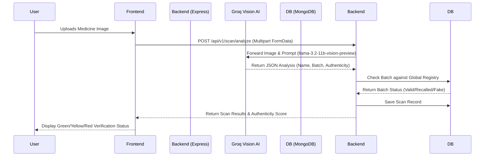
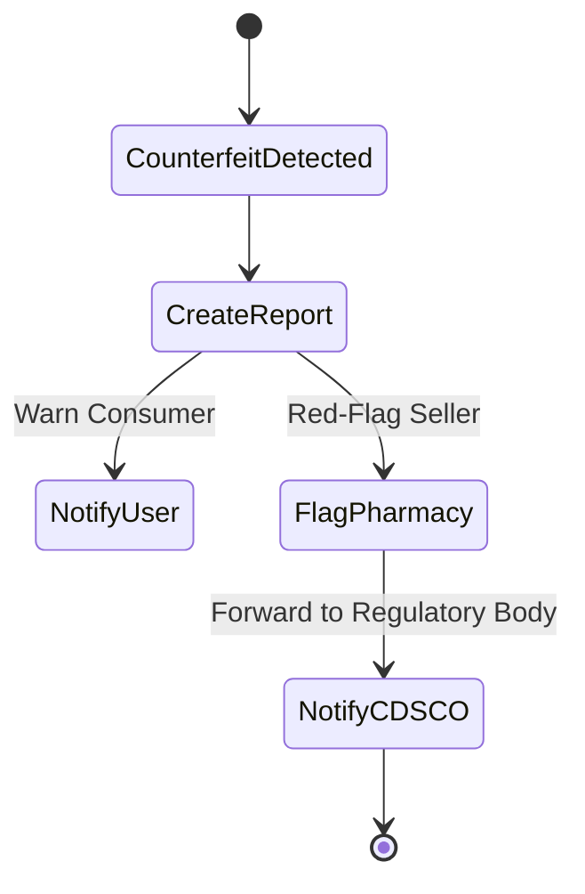

# MediGuard - AI-Powered Fake Medicine Detector 🛡️

**MediGuard** is a next-generation pharmaceutical integrity platform designed to secure the global supply chain. By utilizing advanced neural vision protocols and a robust verified network of chemists, it instantly detects counterfeit medicines, verifies manufacturing batches, and automatically reports anomalies to regulatory bodies (like CDSCO).

---

## 🎯 Core Features
- **Neural Vision Scanner**: Upload photos of medicine strips. Our AI (powered by Groq Vision models) performs sub-millimeter analysis of label textures, typography, and holograms to detect counterfeits.
- **Global Batch Sync**: Live cross-referencing with international regulatory databases and manufacturer repositories to check expiry and recall status.
- **Chemist Verification Network**: A decentralized network of verified pharmacies. Users can find authentic sellers nearby, and malicious pharmacies are instantly blacklisted.
- **CDSCO Direct Integration**: Automated alert triggers and regulatory reporting protocols for severe pharmaceutical violations.

---

## ⚙️ System Architecture & Workflows

### 1. The Verification Workflow (Neural Vision Scan)
This flow describes what happens when a user scans a medicine strip.



### 2. User & Chemist Registration Flow
Pharmacies (Chemists) undergo a strict verification process before they are visible on the public map.

```mermaid
flowchart TD
    A[Registration Screen] --> B{Select Role}
    B -->|User| C[Create Normal User Account]
    B -->|Chemist| D[Input Pharmacy Details & License]
    C --> E[Dashboard (User)]
    D --> F[Status: PENDING]
    F --> G(Admin Review / Auto-Verify against Govt Registry)
    G -->|Approved| H[Status: VERIFIED]
    G -->|Rejected| I[Status: BLACKLISTED]
    H --> J[Visible on 'Nearby Chemists' Map]
    I --> K[Removed from Map / Alerts Triggered]
```

### 3. Reporting & Alert System
If a counterfeit drug is detected, the system automatically creates a case.



---

## 💻 Tech Stack
### Frontend
- **React 18** (Vite)
- **TailwindCSS** (for styling)
- **Framer Motion** & **React Three Fiber** (for premium 3D UI, Antigravity background)
- **React Leaflet** (for Pharmacy mapping)

### Backend
- **Node.js** & **Express.js**
- **MongoDB** (Mongoose)
- **Groq API** (Llama 3.2 Vision)
- **JWT Authentication**

---

## 🚀 Getting Started

### Prerequisites
- Node.js (v18+)
- MongoDB instance (Local or Atlas)
- Groq API Key

### Installation

1. **Clone the repository**
   ```bash
   git clone https://github.com/your-repo/mediguard.git
   cd mediguard
   ```

2. **Setup Backend**
   ```bash
   cd backend
   npm install
   # Create a .env file and add:
   # PORT=5000
   # MONGODB_URI=your_mongo_url
   # JWT_SECRET=your_secret
   # GROQ_API_KEY=your_key
   npm run dev
   ```

3. **Setup Frontend**
   ```bash
   cd ../Frontend
   npm install
   # Create a .env file and add:
   # VITE_API_BASE_URL=http://localhost:5000/api/v1
   npm run dev
   ```

4. **Access the App**
   Open your browser and navigate to `http://localhost:5173`.

---

## 📁 Repository Structure
Please refer to the detailed READMEs in the subdirectories:
- [`/backend/README.md`](./backend/README.md) - For detailed API specifications and backend architecture.
- [`/Frontend/README.md`](./Frontend/README.md) - For React component hierarchy and UI architecture.
